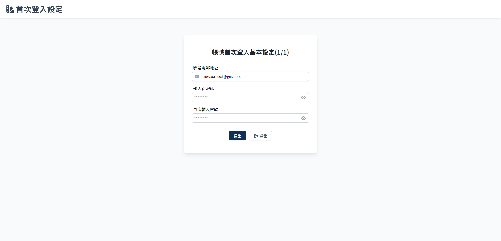

# 綁定帳號資料
> 首次登入須設定 e-mail 及更新密碼。

## 頁面元件

| 項目 | 類型 | 操作 | 系統回應與處理邏輯 |
| --- | --- | --- | --- |
| 驗證郵件地址 | Input | Type | - |
| 輸入新密碼 | Input | Type | - |
| 再次輸入密碼 | Input | Type | - |
| 送出 | Button | Click | 點選後進入 [驗證 e-mail](Pages/Account/verity-email.md) |
| 登出 | Button | Click | 點選後返回 [登入](Pages/Account/login.md) |

## 操作流程
> 參考 [登入](Pages/Account/login.md) 流程。

