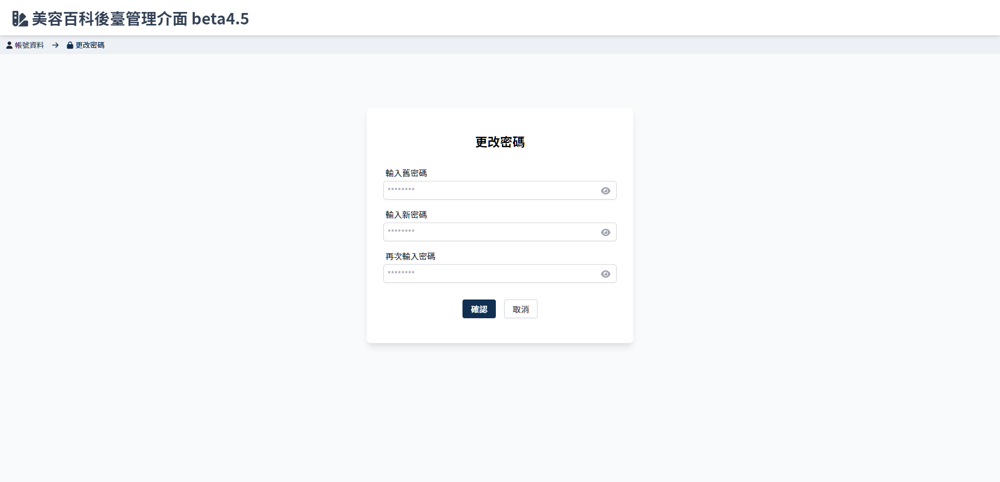

# 更改密碼
> 管理者自行更換密碼。

## 頁面元件
| 項目 | 類型 | 操作 | 系統回應與處理邏輯 |
| --- | --- | --- | --- |
| 輸入舊密碼 | Input | Type | - |
| 輸入新密碼 | Input | Type | - |
| 再次輸入新密碼 | Input | Type | - |
| 確認 | Button | Click | 驗證舊密碼欄位是否符合資料庫data，新密碼是否相互符合 |
| 取消 | Button | Click | 取消操作，返回[帳號資料](Pages/Account/account-info.md) |

!> (二階段)密碼加入英文大小姐與數字組合的限制

