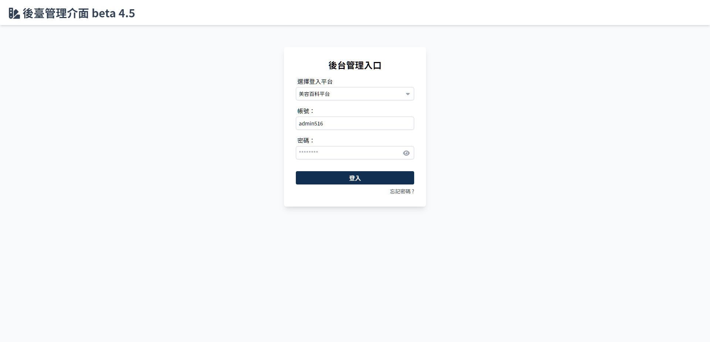
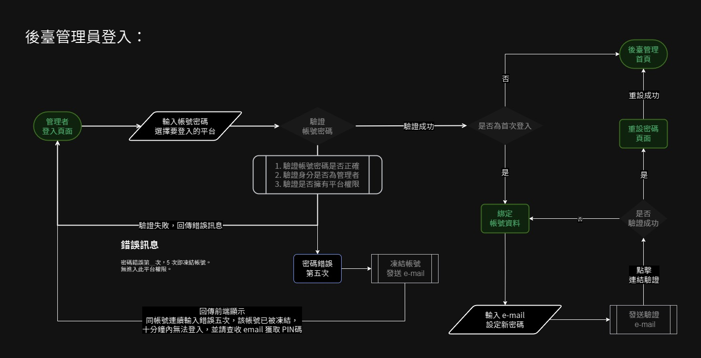

# 登入
> - 管理員登入頁面。
> - 可選擇登入平台。

## 頁面元件

| 項目 | 類型 | 操作 | 系統回應與處理邏輯 |
| --- | --- | --- | --- |
| 選擇平台 | Select | Select | 選擇登入平台 |
| 帳號 | Input | type | - |
| 密碼 | Input | type | - |
| 登入 | Button | Click | - |
| 忘記密碼 | Link | Click | 跳轉至[忘記密碼](Pages/Account/forget-password.md) |

 

## 操作流程與系統判斷

