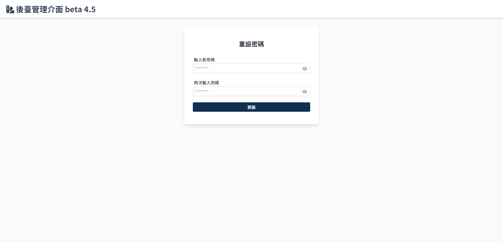

# 重設密碼
> 在[忘記密碼](Pages/Account/forget-password.md)頁面，輸入 e-mail 後若系統驗證有此筆 e-mail 資料便會寄送 e-mail，點選 e-mail 連結後跳轉至此頁面。

## 重設密碼信件

| 項目 | 類型 | 操作 | 系統回應與處理邏輯 |
| --- | --- | --- | --- |
| 重設密碼連結 | Link | Click | 跳轉至[重設密碼](Pages/Account/reset-password.md) |

 

## 重設密碼頁面

| 項目 | 類型 | 操作 | 系統回應與處理邏輯 |
| --- | --- | --- | --- |
| 輸入新密碼 | Input | Type | - |
| 再次輸入新密碼 | Input | Type | - |
| 更新 | Button | Click | 返回[登入](Pages/Account/login.md)頁面 |

