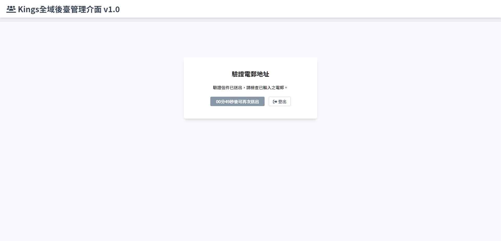
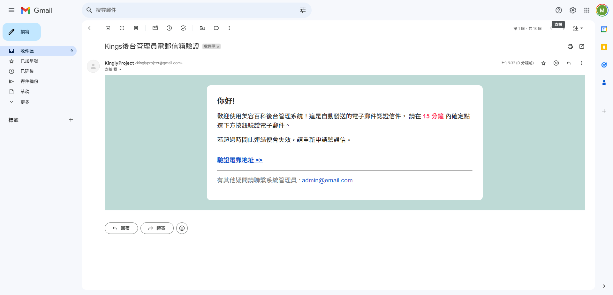
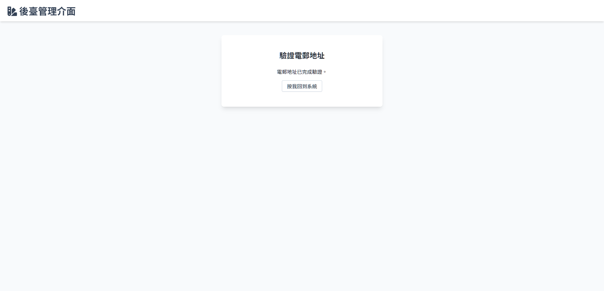

# 驗證 e-mail
> 在[綁定帳號資料](Pages/Account/bind-account.md)頁面內送出後跳轉至此頁面

 

## 認證信件

### 頁面元件
| 項目 | 類型 | 操作 | 系統回應與處理邏輯 |
| --- | --- | --- | --- |
| 驗證電郵 | Link | Click | 開啟[驗證成功](#驗證成功) |

 

## 驗證成功
> 點擊信件內驗證連結後開啟此畫面

| 項目 | 類型 | 操作 | 系統回應與處理邏輯 |
| --- | --- | --- | --- |
| 按我回到系統 | Button | Click | 開啟[帳號資料](Pages/Account/account-info.md)|

