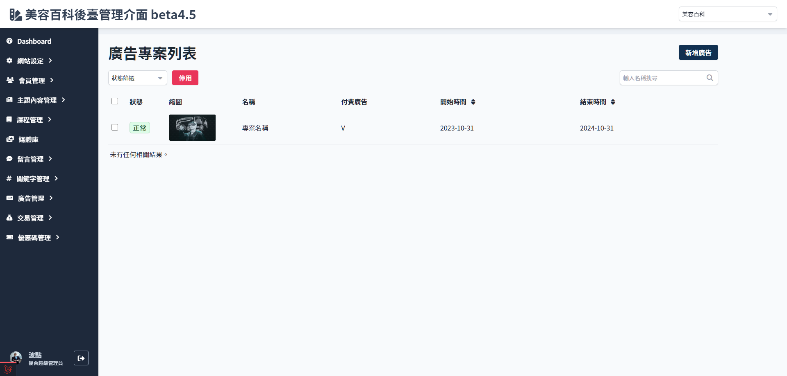

# 廣告專案列表
> - 停用廣告專案
> - 搜尋廣告名稱
> - 廣告專案列表(名稱、縮圖、狀態、日期區間)

 

### 廣告狀態說明
| 狀態 | 說明 | 可編輯名稱 | 可修改日期 | 可修改連結 | 可置換圖片 |
| --- | --- | --- | --- | --- | --- |
| 正常 | 正在前端顯示中 | V | X | V | V |
| 失效 | 過期或者被停用，不可恢復為正常 | X | X | X | X |
| 排程 | 已上傳檔案但日期未到 | V | V | V | V |

## 操作流程與系統判斷

### 廣告專案管理

### 新增廣告專案

### 停用廣告專案

