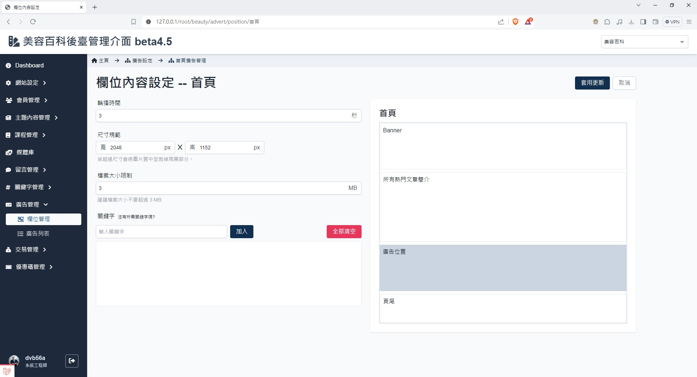
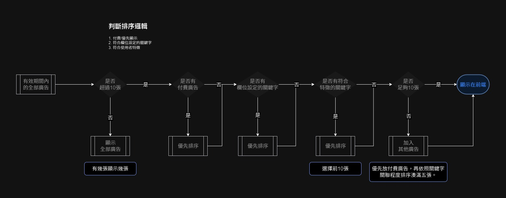

# 欄位設定
> - 調整圖片的顯示頻率
> - 調整欄位圖片尺寸及檔案大小限制
> - 設定優先顯示的關鍵字

 

## 頁面元件

### 按鈕說明
| 項目 | 類型 | 操作 | 系統回應與處理邏輯 |
| --- | --- | --- | --- |
| 套用更新 | Button | Click | 保存變更並驗證欄位是否符合規範 |
| 取消 | Button | Click | 返回 [欄位列表](Pages/Beauty/advertisement/ad-position-list.md) |

### 欄位說明
| 項目 | 類型 | 操作 | 系統回應與處理邏輯 |
| --- | --- | --- | --- |
| 輪播時間 | Input |	-|	設定輪播切換圖片的秒數 |
 | 尺寸規範 | Input |	-|	設定尺寸長寬解析度限制，單位 px |
 | 檔案大小規範 | Input |	-|	設定檔案大小限制，單位 MB |
|關鍵字| Input | Type |至少需要選擇一個類別。 僅能選擇資料庫已有的關鍵字。 不得重複選擇關鍵字。 在input auto complete 設定關聯資料庫。|

 

## 系統判斷邏輯

判斷前端顯示圖片優先順序的邏輯，目前定義最多 10 張輪播。

