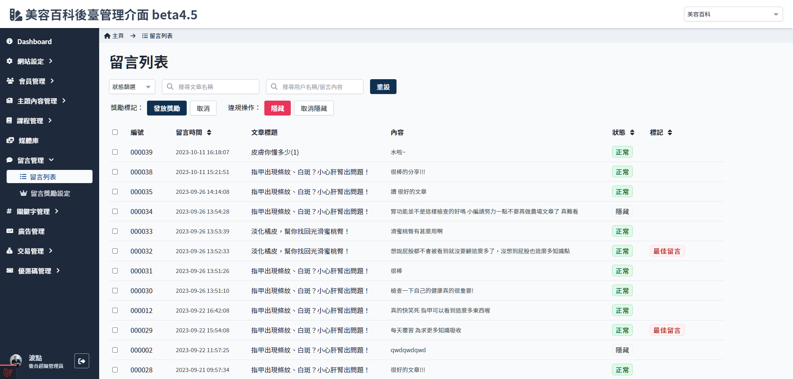
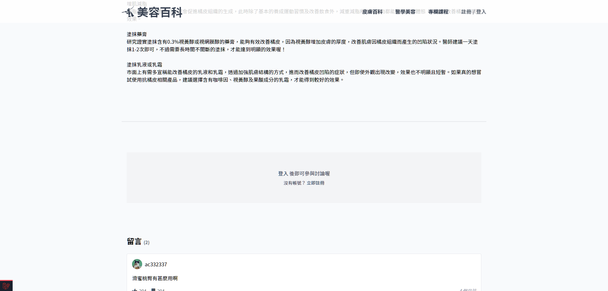
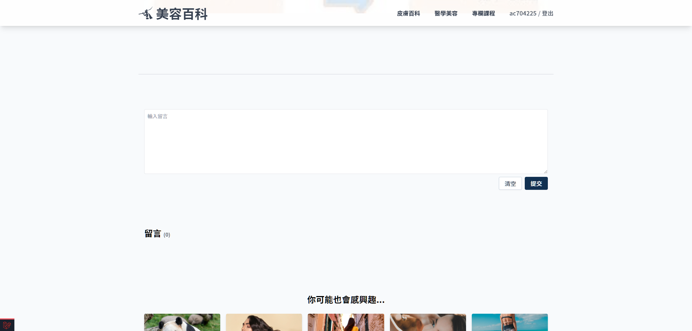
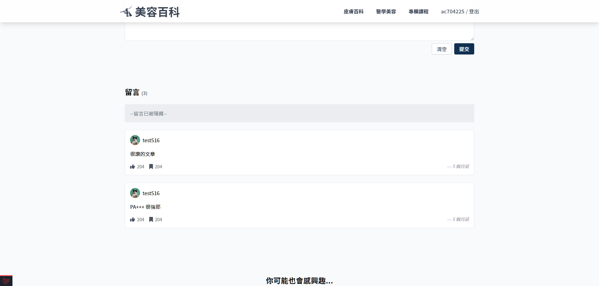

# 留言列表
> - 可以按照時間排序
> - 可以課程篩選 (二階段)
> - 按照狀態篩選
> - 留言帳號及全文搜索
> - 調整留言狀態
> - 標記最佳留言（現階段只能標記，獎勵為二階段）

## 頁面元件
| 項目 | 類型 | 操作 | 系統回應與處理邏輯 |
| --- | --- | --- | --- |
| 篩選狀態 | Select | select | 篩選正常 or 隱藏狀態的留言 |
| 搜索文章/課程名稱 | Input | Type |　以文章/課程搜尋留言（課程相關功能二階段） |
| 搜索會員帳號/留言內文 | Input | Type |　- |
| 重設 | Button | Click | - |
| 發放獎勵 | Button | Click | - |
| 取消 | Button | Click | - |
| 隱藏 | Button | Click | 隱藏後前端該留言會顯示"此留言違反規定" |
| 取消隱藏 | Button | Click | - |
| 留言列表 | Table | - | - |

## 前端網站狀態說明

### 未登入無法留言

### 登入情況下可正常留言

### 被隱藏的留言

