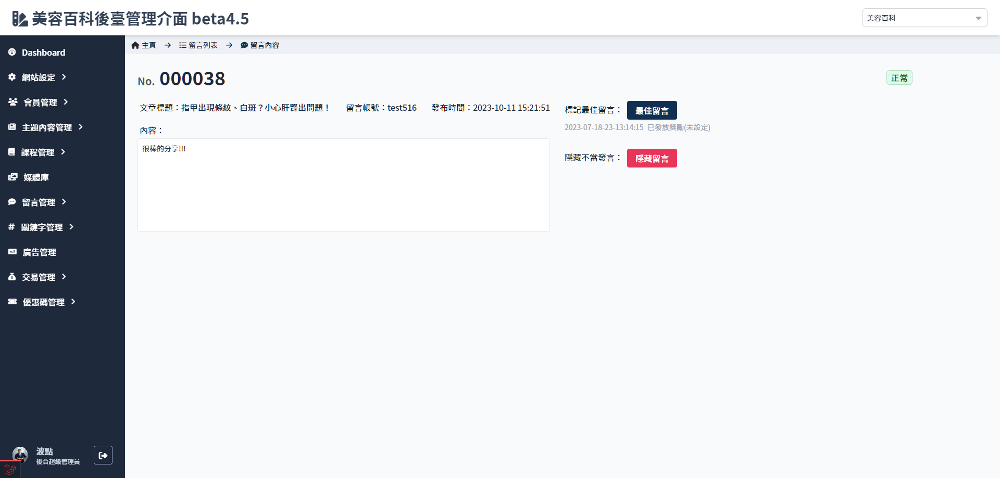

# 留言內容
> - 顯示留言位置、留言時間、會員帳號、內容
> - 隱藏/取消隱藏
> - 標記最佳留言（）

## 頁面元件
| 項目 | 類型 | 操作 | 系統回應與處理邏輯 |
| --- | --- | --- | --- |
| 最佳留言/取消標記 | Button | Click | 依狀態顯示不同功能按鈕 |
| 隱藏留言/取消隱藏 | Button | Click | 依狀態顯示不同功能按鈕 已標記為**最佳留言**的留言無法隱藏 |
| 留言內容 | Textarea | Type | - |

