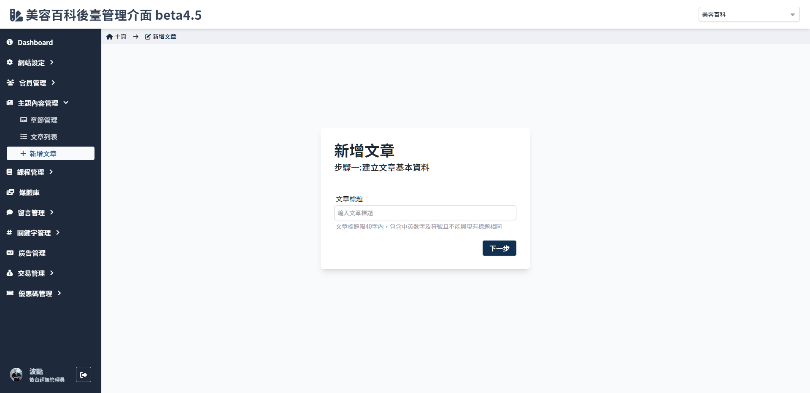
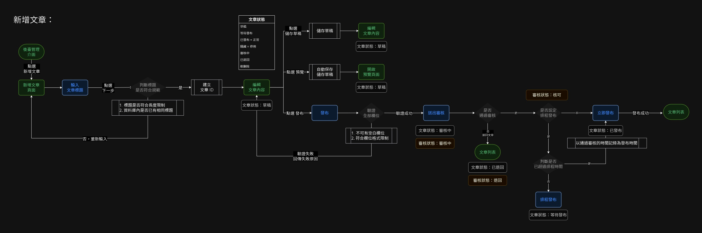

# 新增文章
> 建立新文章時步驟一畫面。

 

 

## 頁面元件
### 欄位限制
| 項目 | 類型 | 操作 | 系統回應與處理邏輯 |
| --- | --- | --- | --- |
|文章標題|	input | type|	建立文章 ID|

 

### 按鈕行為
|按鈕|	行為|	說明|
|---|---|---|
|下一步| -|		跳轉至[文章](Pages/Beauty/content/article.md)|

 

## 操作流程

