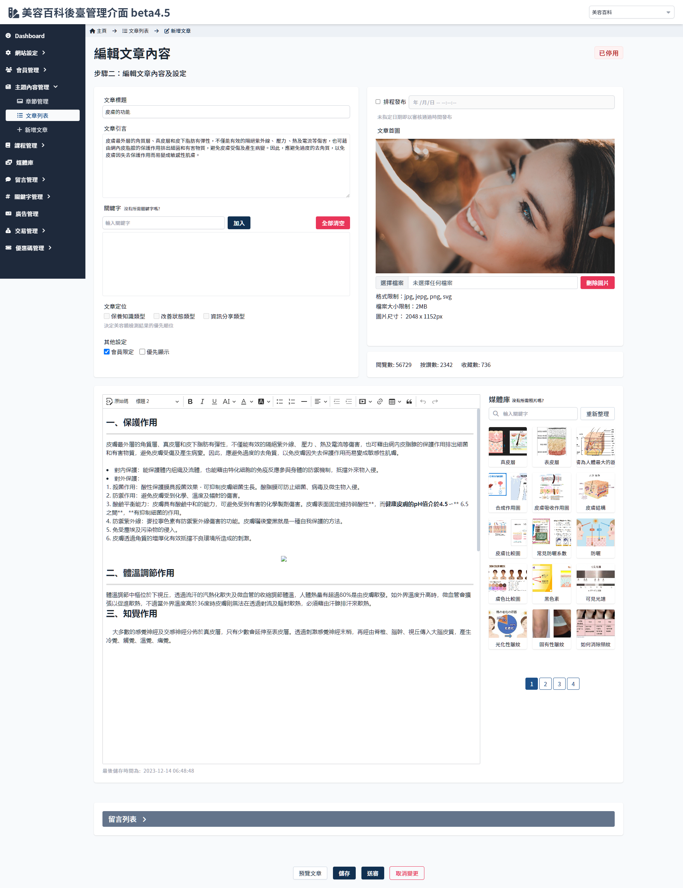
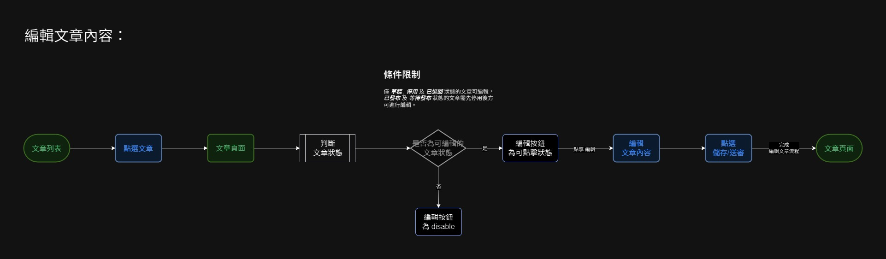

# 編輯文章
> - 僅 草稿 , 停用 及 已退回 狀態的文章可編輯，已發布 及 等待發布 狀態的文章需先停用後方可進行編輯。
> - 參考 [文章列表](Pages/Beauty/content/article-list.md) 內的文章狀態說明。

 

 

## 頁面元件

### 欄位限制
| 項目 | 類型 | 操作 | 系統回應與處理邏輯 |
| --- | --- | --- | --- |
|文章標題| Input |	-|	建立文章 ID|
|引言| Input | Type | 格式限制為文字，上限 255字|
|首圖| File | upload |	需符合文章首圖之媒體類別限制|
|關鍵字| Input | Type |至少需要選擇一個類別。 僅能選擇資料庫已有的關鍵字。 不得重複選擇關鍵字。 在input auto complete 設定關聯資料庫。|
|優先顯示|	checkbox | choose |	在文章列表可優先顯示|
|會員限定|	checkbox |	choose |	限制未登入的訪客無法觀看|
|撰寫人| -- | -|	抓取登入操作者的 id|
|內文撰寫|	textarea | Type |	輸入格式為文字，上限為 10000 字|
|側欄媒體庫|	—|	-|	用以輔助文章內插入圖片使用|
|排程發布|	checkbox | choose|	勾選後可選擇發布時間 已發布文章不可重設為排程|
|發布時間|	date picker | choose |	若有勾選排程發布，可自訂發布時間。 若未勾選排程發布，則以文章按出送出當下時間為發布時間。|

 

### 編輯文章按鈕行為
| 項目 | 類型 | 操作 | 系統回應與處理邏輯 |
| --- | --- | --- | --- |
| 儲存草稿 | Button | Click | 僅 草稿狀態 顯示此按鈕|
| 預覽文章 | Button | Click | 將目前所有已輸入之資料新增至新的一筆並列為草稿狀態。 草稿狀態 下點選 預覽文章，強制儲存草稿。|
|送出/更新|	Button | Click |將目前所有已輸入之資料新增並驗證所有已輸入內容是否符合規定。|
|取消| Button | Click | - |
|預覽文章| Button | Click |	顯示前端預覽畫面。 停用狀態下不顯示  已發布文章不可編輯 開啟新分頁[預覽文章](Pages/Beauty/content/preview-article.md)|

 

## 操作流程與系統判斷

