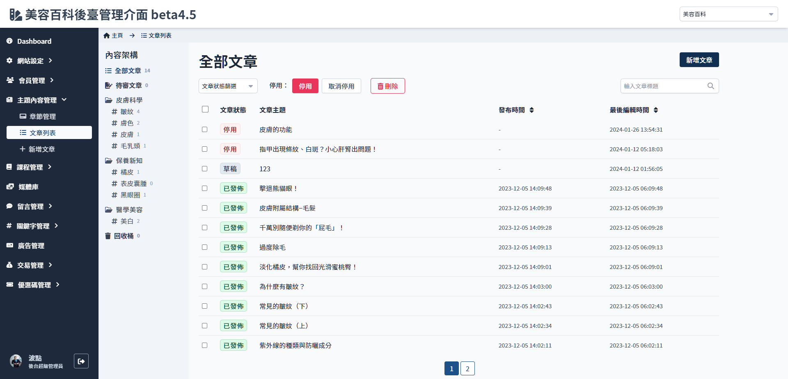

# 文章列表
> - 檢視全部文章狀態及批量編輯管理
> - 可按照章節設定的關鍵字檢視
> - 搜尋文章標題

 

 

## 頁面元件

| 項目 | 類型 | 操作 | 系統回應與處理邏輯 |
| --- | --- | --- | --- |
| 新增文章 | Button | Click | 參考[新增文章](./add-article.md)內新增文章操作流程 |
| 停用/取消停用 | Button | Click | 僅 發布 與 等待發布 狀態可被停用。 批量操作時，若有其中一個選擇不符合條件，即略過該項，僅符合條件者執行操作。|
| 刪除 | Button | Click | 批量操作時，若有其中一個選擇不符合條件，即略過該項，僅符合條件者執行操作。 |
| 搜尋 | input | type | 僅搜尋文章標題 |

 

## 文章狀態說明

| 狀態 | 編輯 | 軟刪除 | 停用 | 送出 | 取消操作 | 回復操作 | 永久刪除 | 說明 |
| --- | --- | --- | --- | --- | --- | --- | --- | --- |
| 草稿 | V | V | - | V | - | - | - | 建立文章後的預設狀態 |
|等待發布| - | - | V | - | - | - | - | [編輯文章](Pages/Beauty/content/article-edit.md)內選擇排程發布，通過審核且未到發布時間時顯示此狀態 |
|已發布 (正常)| - | - | V | - | - | - | - |
|停用 (隱藏)| V | V | - | - | V | - | - | 文章列表內文章點選停用後變更為此狀態，詳細限制參考[停用文章流程](#停用文章) |
|審核中| - | - | - | - | V | - | - | 草稿狀態及已退回狀態下點選送出審核即變更為此狀態，參考[審核文章流程](#審核文章) |
|已退回| V | V | - | V | - | - | - | 同草稿狀態|
|軟刪除| - | - | - | - | - | V | V | 軟刪除的文章會被放在回收桶，可還原 參考[刪除文章流程](#刪除文章) |

 

## 操作流程與系統判斷

### 審核文章

- 首次通過審核的時間記錄微發布時間，假設之後

 

### 停用文章

 

### 刪除文章

!> 永久刪除為不可逆的操作。

