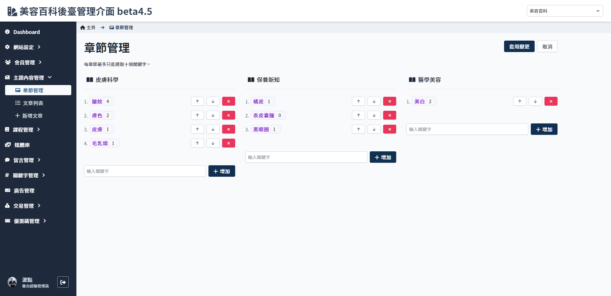
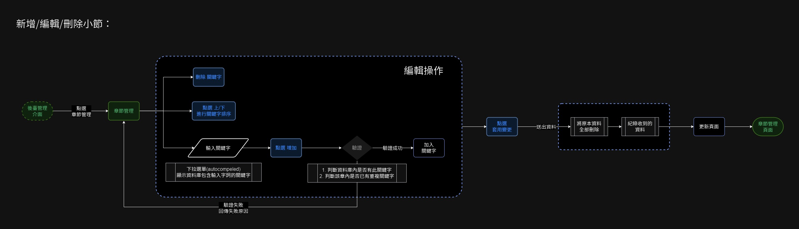

# 章節管理
> 可設定章節內要包含的關鍵字。

!> 暫定先固定章節數量與名稱，後續可開發 **增加章節** 及 **修改章節名稱** 兩個功能。

 

 

## 頁面元件
- 頁面說明文字：每章節最多只能選取十個關鍵字。

### 基本操作

| 項目 | 類型 | 操作 | 系統回應與處理邏輯 |
| --- | --- | --- | --- |
| 套用變更 | Button | Click | 儲存變更 |
| 取消 | Button | Click | 取消全部更動 |

 

### 關鍵字
| 項目 | 類型 | 操作 | 系統回應與處理邏輯 |
| --- | --- | --- | --- |
| 向上排序 | Button | Click | 該列關鍵字上移 |
| 向下排序 | Button | Click | 該列關鍵字下移 |
| 刪除 | Button | Click | 刪除該列關鍵字 |

 

### 加入關鍵字
| 項目 | 類型 | 操作 | 系統回應與處理邏輯 |
| --- | --- | --- | --- |
| 輸入框關鍵字 | input | type | 偵測輸入後，下拉選單匹配顯示資料庫內包含輸入字詞的關鍵字 |
| 增加 | Button | click | 點擊後後端檢測輸入的字詞是否與

