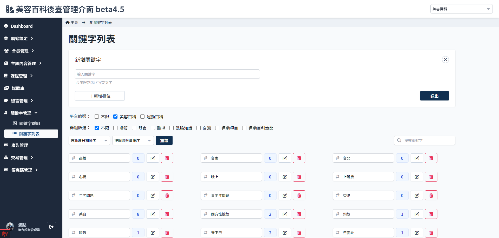
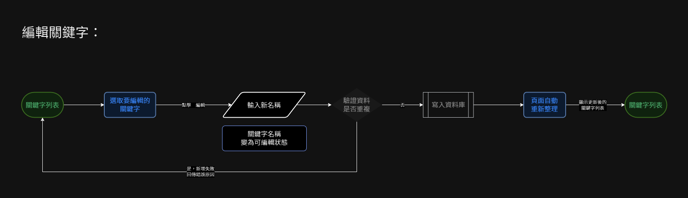

# 關鍵字列表
> - 顯示全部關鍵字列表及其關連數量
> - 可新增/編輯/刪除關鍵字(條件限制)
> - 篩選平台/關鍵字群組
> - 搜尋關鍵字
> - 按照日期或者關聯數量排序

##　頁面元件

| 項目 | 類型 | 操作 | 系統回應與處理邏輯 |
| --- | --- | --- | --- |

### 新增關鍵字
> 點選 **增加欄位** 可同時新增數個關鍵字

## 操作流程

###　新增關鍵字

### 編輯關鍵字

### 刪除關鍵字
> 有關連項目的關鍵字無法刪除，必須到文章編輯頁面內先移除關鍵字才可操作

