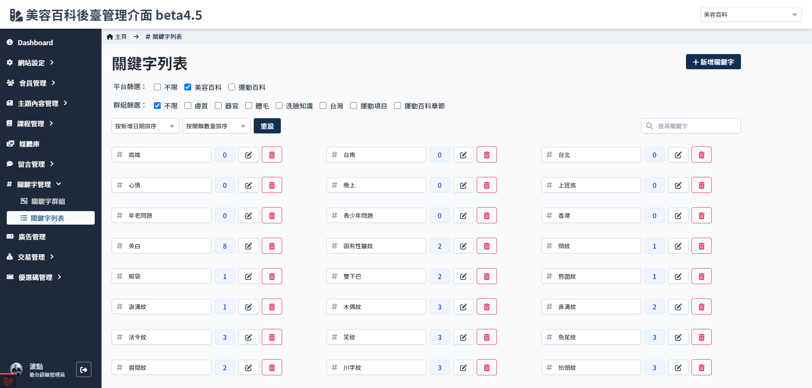
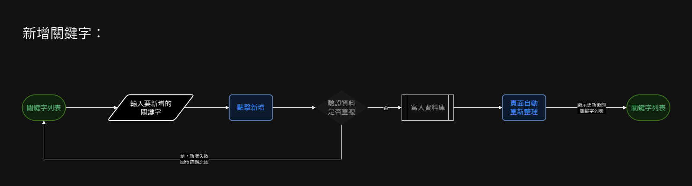
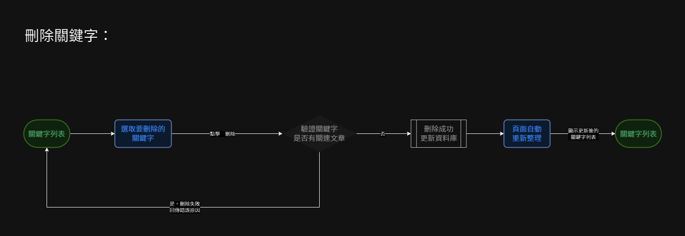

# 關鍵字列表
> - 顯示全部關鍵字列表及其關連數量
> - 可新增/編輯/刪除關鍵字(條件限制)
> - 篩選平台/關鍵字群組
> - 搜尋關鍵字
> - 按照日期或者關聯數量排序

##　頁面元件

| 項目 | 類型 | 操作 | 系統回應與處理邏輯 |
| --- | --- | --- | --- |
| 新增關鍵字 | Button | Click | 點擊後顯示新增關鍵字的欄位 [畫面示意](Pages/Beauty/keyword/keyword-list.md#新增關鍵字流程) |
| 平台篩選 | Checkbox | choose | - |
| 群組篩選 | Checkbox | choose | - |
| 日期排序 | Select | select | - |
| 關聯數量排序 | Select | select | - |
| 重設 | Button | Click | 清除排序設定 |
| 搜尋 | Input | Type | - |

### 新增關鍵字欄位
| 項目 | 類型 | 操作 | 系統回應與處理邏輯 |
| --- | --- | --- | --- |
| close | Button | Click | 關閉新增關鍵字功能區塊，不保存變更 |
| 輸入關鍵字 | Input | Type | 輸入要創建的關鍵字名稱 |
| 新增欄位 | Button | Click | 可同時新增多個關鍵字，點此按紐會加入欄位，最多可同時新增十個關鍵字 |
| 送出 | Button | Click | 點擊後系統驗證是否有重複關鍵字，若有重複關鍵字，退回全部資料且回傳該錯誤關鍵字 |

### 關鍵字
| 項目 | 類型 | 操作 | 系統回應與處理邏輯 |
| --- | --- | --- | --- |
| 關鍵字名稱 | Input | Type | 預設不可更改，點擊　**編輯** 後變為可更改的狀態 |
| 關聯數量 | Link | Click | 點擊後開啟[關鍵字關聯列表](Pages/Beauty/keyword/keyword-related-list.md) |
| 修改/保存 | Button | Click | 點擊 **保存** 後系統驗證是否有重複 |
| 刪除 | Button | Click | 有關聯內容時無法刪除 |

### 新增關鍵字流程
> 點選 **增加欄位** 可同時新增數個關鍵字

## 操作流程

###　新增關鍵字

### 編輯關鍵字

### 刪除關鍵字
> 有關連項目的關鍵字無法刪除，必須到文章編輯頁面內先移除關鍵字才可操作

