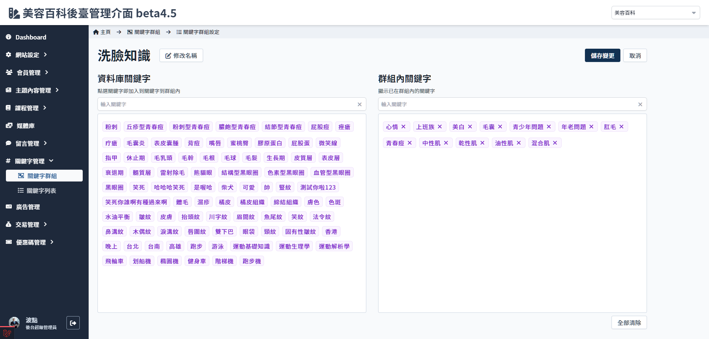

# 設定關鍵字群組

##　頁面元件

| 項目 | 類型 | 操作 | 系統回應與處理邏輯 |
| --- | --- | --- | --- |
| 修改名稱/完成/取消 | Button | Click | 點選修改名稱後，群組名稱會顯示為可修改的狀態，點選完成/取消後恢復。 不管編輯幾次，如果沒有按 **儲存變更** 的情況下按取消按紐，會回復為最初的名稱；點選 **儲存變更** 後驗證群組名稱是否有重複，若有重複名稱，所有更動皆會被取消。  |
| 保存變更 | Button | Click | - |
| 取消 | Button | Click | - |
| 輸入關鍵字 | Input | Type | 依照所輸入的字串篩選下方資料庫 |
| 全都清除 | Button | Click | 清除全部已被設定的關鍵字 |

