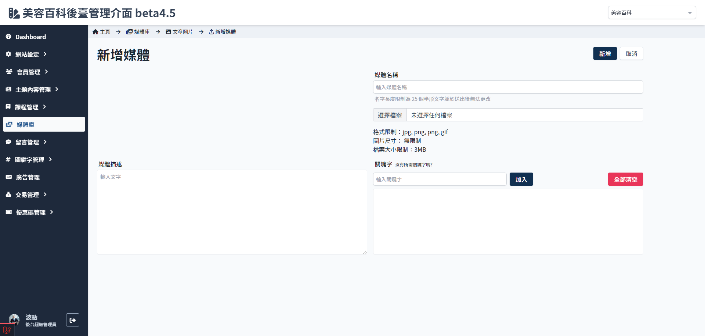
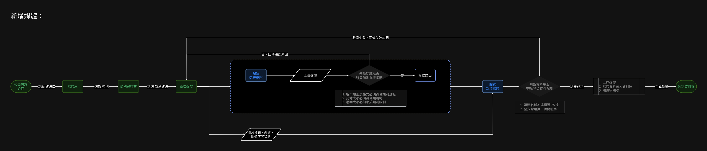

# 新增媒體

## 頁面元素
| 項目 | 類型 | 操作 | 系統回應與處理邏輯 |
| --- | --- | --- | --- |
| 新增 | Button | Click | 檢查上傳圖片／各欄位是否符合規範，不符回傳錯誤提示 |
| 取消 | Button | Click | - |
| 媒體名稱 | Input | Type | 送出後不可更改 |
| 選擇檔案 | file | upload | - |
| 媒體描述 | Textarea | Type | - |
| 關鍵字 | Input | Type | 至少需選擇一個關鍵字 |

## 操作流程

