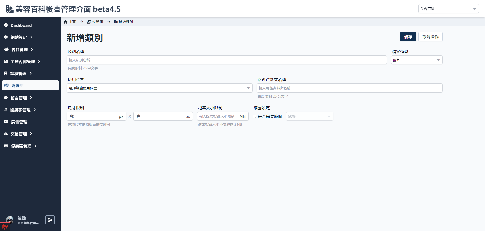
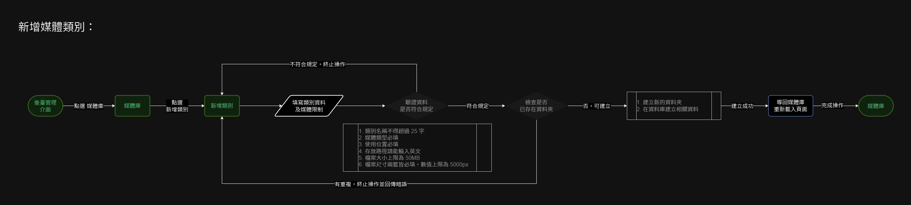

# 新增媒體類別
> - 類別名稱
> - 媒體檔案尺寸及大小限制
> - 使用位置及資料夾名稱
> - 是否需要縮圖及縮圖比例設定

## 頁面元件
| 項目 | 類型 | 操作 | 系統回應與處理邏輯 |
| --- | --- | --- | --- |
| 儲存 | Button | Click | - |
| 取消 | Button | Click | - |
| 類別名稱 | Input | Type | 設定後不可更改 |
| 檔案類型 | Select | select | 選擇圖片or影片 設定後不可更改 |
| 使用位置 | Select | select | 設定後不可更改 若需要其他位置須由資料庫管理員新增 |
| 路徑資料夾名稱 | Input | Type | 設定後不可更改 此為資料庫內的資料夾名稱 |
| 尺寸限制 | Input | Type | 單位為px，限制圖片最大尺寸 設定後不可更改 |
| 檔案大小限制 | Input | Type | 設定後不可更改 |
| 是否需要縮圖 | Checkbox | Choose | 設定後不可更改 |
| 縮圖比例 | Select | select | 設定後不可更改 |

## 操作流程

