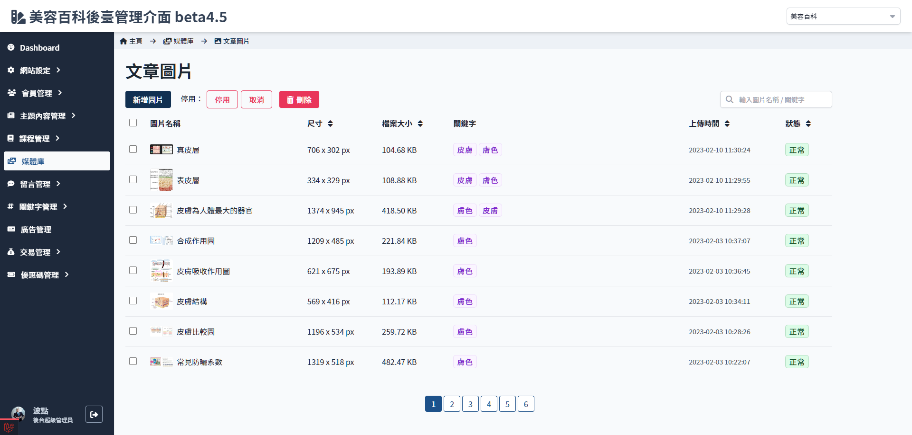
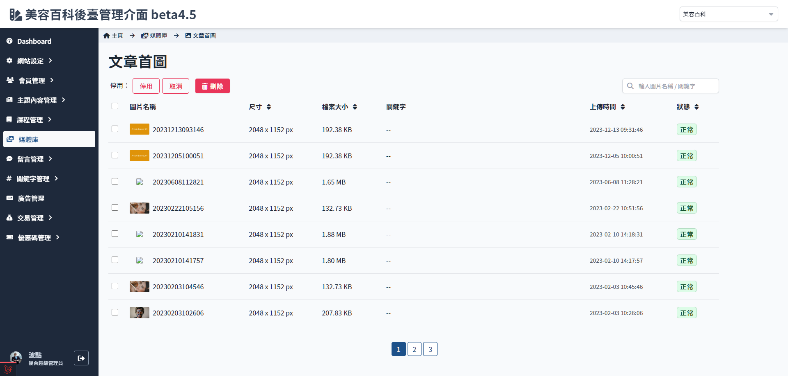
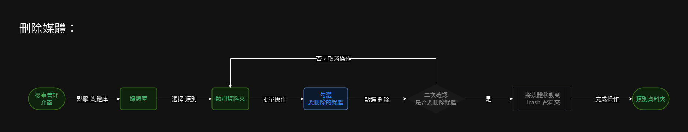

# 媒體列表
> - 想是類別內的媒體列表
> - 可依條件排序媒體
> - 改變媒體狀態
> - 刪除媒體

## 頁面元素
### 一般狀態顯示

| 項目 | 類型 | 操作 | 系統回應與處理邏輯 |
| --- | --- | --- | --- |
| 新增媒體 | Button | Click | 開啟 [新增媒體](Pages/Beauty/media/add-media.md) |
| 停用 | Button | Click | - |
| 取消 | Button | Click | - |
| 刪除 | Button | Click | - |
| 媒體列表 | Table | - | 點選後開啟 [媒體內容](Pages/Beauty/media/media-info.md) |

 

### 其他狀態
> 文章首圖須由 [編輯文章](Pages/Beauty/content/article-edit.md) 或者 [新增文章](Pages/Beauty/content/add-article.md) 內上傳，因此文章首圖這類別不顯示 **新增圖片** 按鈕

## 操作流程

### 媒體狀態變更

### 刪除媒體流程

