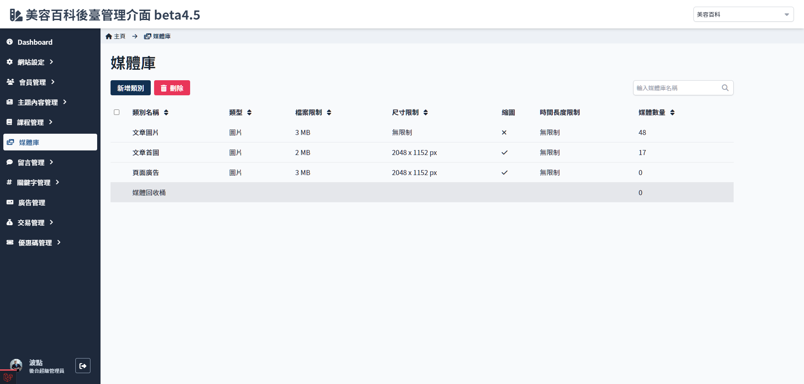
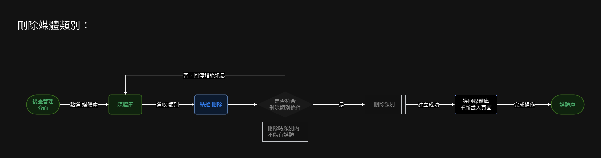

# 媒體類別清單
> - 新增/刪除類別

## 頁面元素

| 項目 | 類型 | 操作 | 系統回應與處理邏輯 |
| --- | --- | --- | --- |
| 新增類別 | Button | Click | 開啟 [新增媒體類別](Pages/Beauty/media/add-mediafolder.md)|
| 刪除 | Button | Click | 刪除媒體類別，參考[刪除媒體類別流程](Pages/Beauty/media/mediafolder-list.md#刪除媒體類別) |
| 類別清單 | Table | - | 點擊後開啟該類別[媒體列表](Pages/Beauty/media/media-list.md) |

## 操作流程

### 新增媒體類別

### 刪除媒體類別

