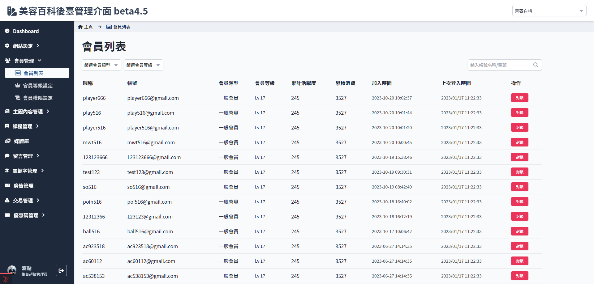

# 會員列表
> - 檢視會員列表
> - 篩選會員類型及會員等級
> - 封鎖會員

## 頁面功能

| 項目 | 類型 | 操作 | 系統回應與處理邏輯 |
| --- | --- | --- | --- |
| 篩選會員類型 | select | select | - |
| 篩選會員等級 | select | select | - |
| 搜尋 | Input | Type | 搜尋帳號名稱或 e-mail |
| 會員資料 | table | - | 點選暱稱開啟會員[會員資料](Pages/Beauty/member/member-info.md) |
| 封鎖 | Button | Click | - |

