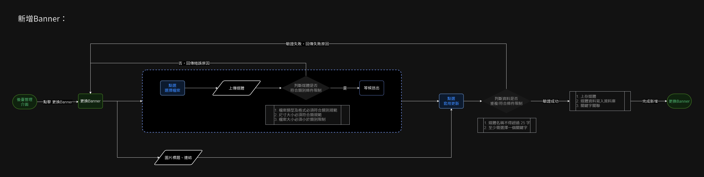
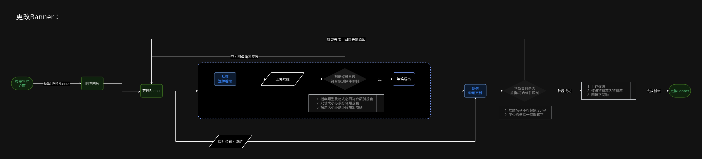
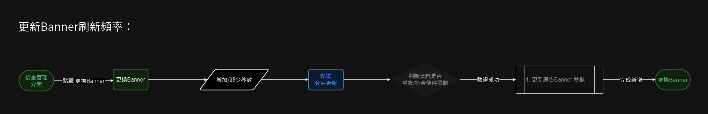
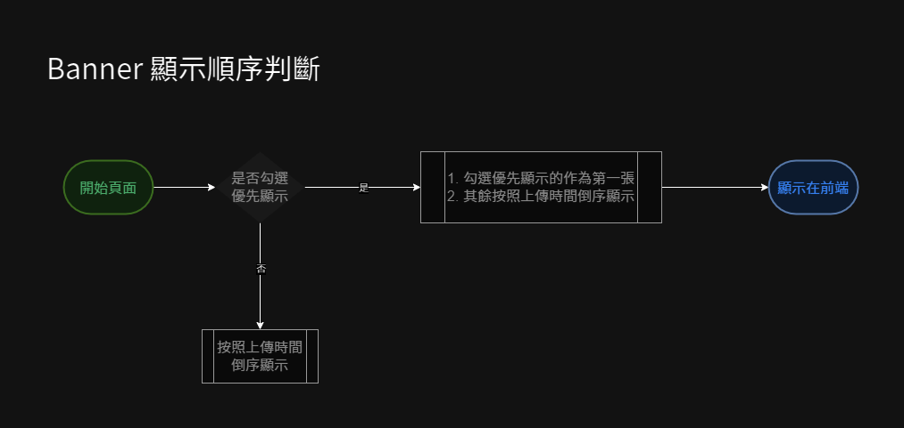

# 更換 Banner
> - 更換首頁 Banner
> - 設定輪播間隔時間
> - 設定優先顯示的 Banner

## 頁面元件

| 項目 | 類型 | 操作 | 系統回應與處理邏輯 |
| --- | --- | --- | --- |
| 套用更新 | Button | Click | - |
| 取消操作 | Button | Click | - |
| 輪播時間設定 | Input | Type | 輸入秒數 |
| 選擇檔案 | File | upload | 須符合 banner 圖片格式及尺寸大小限制 |
| 圖片標題 | Input | Type | - |
| 優先顯示 | Checkbox | Choose | 設為優先顯示的圖片排序會調整為第一張，若同時數張設定優先顯示，則按照上傳時間倒序顯示 |
| 圖片連結 | Input | Type | 在首頁點擊圖片後跳轉至連結 |

<!-- TODO banner的排序方式? -->

## 操作流程與系統判斷

### 新增 banner

### 更新 banner

### 變更間隔時間

### Banner 顯示順序判斷

