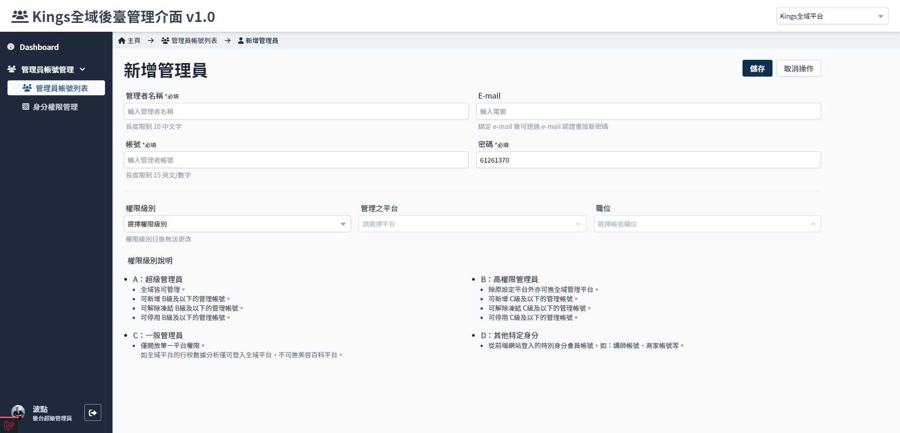

# 新增管理員帳號
> - 建立新的管理員帳號。
> - 設定帳號層級及身分功能權限。
> - 停用帳號(高權限管理員)。

 

## 頁面元件
| 項目 | 類型 | 操作 | 系統回應與處理邏輯 |
| --- | --- | --- | --- |
| 帳號名稱 | Input | Type | - |
| 權限級別 | Select | Select | 僅可選擇自身以下的層級，如 B 級管理員僅能選擇 C, D 級 | 參考[管理員帳號層級說明](Pages/Center/admin/administer-manage.md) |
| 密碼 | Input | Type | 預設生成隨機碼 |
| e-mail | Input | Type | 首次登入時強制綁定 忘記密碼及解除凍結狀態需要 |
| 帳號權限 | Checkbox | Choose | 從預設角色選單勾選相應功能，後續可至帳號管理裡調整細項| |

