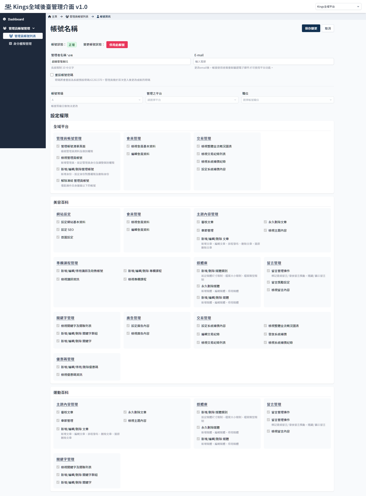

# 帳號資訊
> - 檢視管理員帳號資料
> - 修改管理員帳號密碼、顯示名稱、 email

 

## 頁面元件

| 項目 | 類型 | 操作 | 系統回應與處理邏輯 |
| --- | --- | --- | --- |
| 管理員名稱 | Input | Type | - |
| E-mail | Input | Type | 更改email後，帳號使用者需重新驗證電子郵件才可使用平台功能。登入時導向 [驗證 e-mail](Pages/Account/verity-email.md) 頁面。 若該帳號為登入狀態，會在任何刷新頁面的操作後跳轉至 [驗證 e-mail](Pages/Account/verity-email.md) 頁面 |
| 重設帳號密碼 | Checkbox | Choose | 勾選此欄位後保存變更，此帳號的密碼會強制更新為預設密碼，同時系統發送email通知密碼已被重設(此功能待開發)。 更新後若以原密碼登入即會判定為密碼錯誤。 該帳號如果為登入狀態，會在任何刷新頁面的操作後跳轉至 [重設密碼](Pages/Account/reset-password.md) 強迫更新密碼。 |
| 權限級別 | Select | Select | - |
| 管理平台 | Select | Select | - |
| 職位 | Select | Select | - |

## 權限設定說明
> - 參考 [管理員帳號層級說明](Pages/Center/admin/administer-manage.md) 及 [身分權限說明](Pages/Center/role/role-manage.md)
> - 原則上每個帳號的權限由所設定的身份決定，但可以另外在權限列表增加其他功能權限，但無法移除身份所預設的功能，且無法設定超過帳號等級的功能權限。

