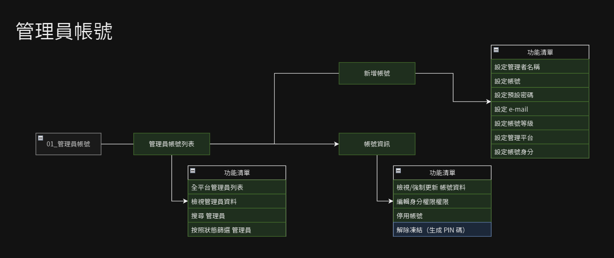

# 管理員員帳號管理

> - 包含[管理員帳號列表](Pages/Center/admin/administer-list.md)、[新增管理帳號](Pages/Center/admin/add-administer.md)、[帳號資訊](Pages/Center/admin/administer-info.md)三個頁面。
> - 管理員帳號有*等級*及*身分*兩個設定參數，等級決定帳號管理的權限；身分用來設定平台內功能操作。

 

## 系統架構圖

 

## 帳號層級
| 權限級別 |職稱 | 忘記密碼操作 | 權限說明 |
|---|---|---|---|
| S | 資料庫管理員 | 沒救了 | 可新增管理帳號。 可解除凍結管理帳號。 可停用管理帳號。 |
| A | 超級管理員 |	e-mail 及 PIN 雙重認證 (PIN 碼須從上級管理員取得）| 全域皆可管理。 可新增 B級及以下的管理帳號。 可解除凍結 B級及以下的管理帳號。 可停用 B級及以下的管理帳號。 |
| B | 高權限管理員 | e-mail 及 PIN 雙重認證 (PIN 碼須從上級管理員取得）| 除原設定平台外亦可進全域管理平台。 可新增 C級及以下的管理帳號。 可解除凍結 C級及以下的管理帳號。 可停用 C級及以下的管理帳號。 |
| C | 一般管理員 |	e-mail 重設 | 僅開放單一平台權限（如全域平台的行校數據分析僅可登入全域平台，不可進美容百科平台）。 |
| D | 其他特定身分 | e-mail 重設 | 從前端網站登入的特別身分會員帳號，如：講師帳號、商家帳號等。	 |

 

## 帳號狀態說明
| 狀態 | 說明 |
| --- | --- |
| 正常 | |
| 凍結 | 密碼錯誤 5 次後帳號會被凍結，使用 PIN 碼解除凍結 |
| 停用 | 暫停使用的帳號 |

