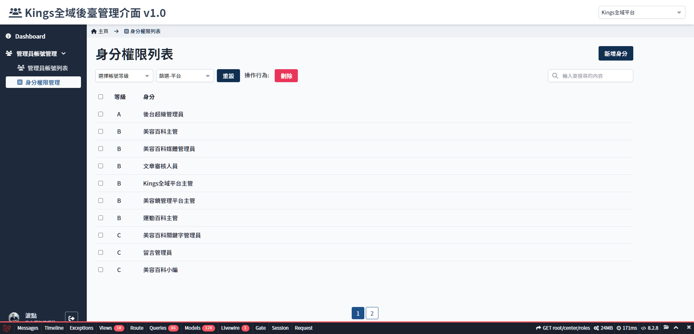

# 身份權限列表
> - 檢視所有已設定的身份列表
> - 以等級/平台篩選身份

## 頁面元件

| 項目 | 類型 | 操作 | 系統回應與處理邏輯 |
| --- | --- | --- | --- |
| 新增身份 | Button | Click | 開啟 [新增身分](Pages/Center/role/add-role.md) 頁面 |
| 選擇帳號等級 | Select | Select | - |
| 篩選平台 | Select | Select | - |
| 重設 | Button | Click | 清除已經設定的篩選條件 |
| 刪除 | Button | Click | **已被帳號設定的身份無法被刪除** |
| 搜尋 | Input | Type | 搜尋身份名稱 |
| 身份列表 | Link | Click | 點選任一身份開啟 [設定身分權限](Pages/Center/role/set-role.md) 頁面 |

