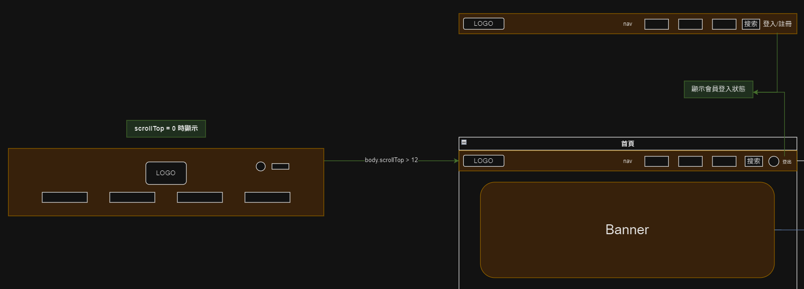

# Header
> 以最高 z-index 顯示在每個頁面，貼緊視窗上緣，隨滾動變化尺寸及透明度。

## 功能說明
- 在任何頁面點擊 logo 回到[首頁](Pages/layout/homepage/default.md)。
- 顯示客戶登入狀態。若未登入，顯示尚未登入；若已登入則顯示客戶姓名。
- 顯示搜索圖式。
- 使用者視窗置頂的時候展開 header 放大 logo。

## 畫面示意

| 項目     | 格式      | 互動操作  | 系統回應與處理邏輯   |
| -------- | --------- | ----------------- | ---------------------------------------------------------------------------------------------------------------------------------------------------- |
| LOGO     | 圖片      | Click   | 任何頁面點擊 logo 回到 [首頁](Pages/layout/homepage/default.md)  |
| 導覽列   | Link      | Click/Hover       | 按 [章節API](https://beautyapp2.docs.apiary.io/#reference/0/a003-/get) 傳入的 data 依序顯示章節分類，最多顯示 6 個。      |
| 搜索     | icon/form | Click/Type/Submit | 預設僅顯示搜索 icon。  點擊後拉伸顯示輸入框及搜索按鈕，送出搜索內容後頁面內容隨之變化為 [搜尋結果列表](Pages/layout/homepage/searchresult.md)。   |
| 登入狀態 | Html區塊  | Click   | 顯示會員登入狀態。 若未登入，顯示登入及註冊文字連結，點擊後分別跳轉至 [登入](Pages/layout/account/login.md) 或 [註冊會員](Pages/layout/account/signup.md) 頁面；若已登入則顯示會員名稱，點擊會員名稱跳轉至 [會員專區](Pages/layout/mamber/mamberarea.md)。 |

!> 超過六個章節分類時如何展示?
