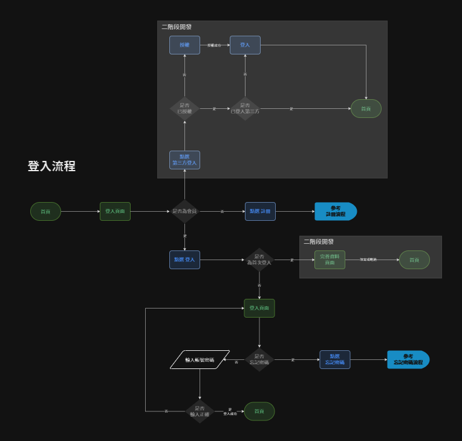
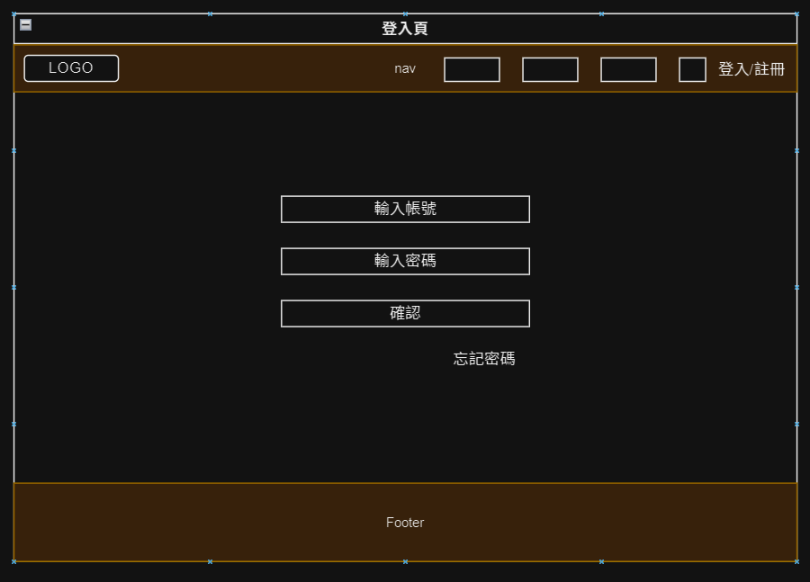

# 登入
> 會員可登入系統並可登出系統。

## 操作流程

## 頁面元件

|頁面元件|類別|操作|系統回應與詳細處理邏輯|
|---|---|---|---|
|會員帳號|input|type|1. 預設狀態:Enable 2. 必填|
|密碼|input|type|1. 預設狀態:Enable 2. 必填|
|確定|Button|Submit|參考登入流程   1. 登入成功：跳出登入成功提示，引導回首頁   2. 登入失敗：輸入框 Warning 狀態， help text 提示帳號密碼錯誤 |
|忘記密碼|Link|Click|跳轉至 [忘記密碼](Pages/layout/account/forgetpw.md) |
