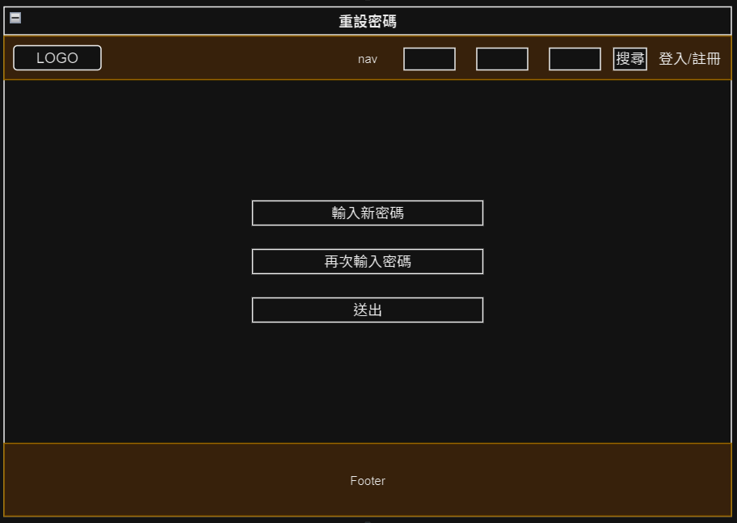

# 重設密碼
> 使用者點擊認證 email 內連結後導向到此頁面設定新密碼。

|頁面元件|類別|操作|系統回應與詳細處理邏輯|
|---|---|---|---|
|新密碼|Input|Type|1.  預設狀態:Enable <br2. 必填|
|再次輸入密碼|Input|Type|1.  預設狀態:Enable   2. 必填|
|送出|Button|Submit|驗證 input 內資料是否相符: 1. 相符：頁面導向至 [重設密碼成功](Pages/layout/account/resetsuccess.md)  2. 不相符：送出失敗，停留此頁面顯示錯誤提示 |

