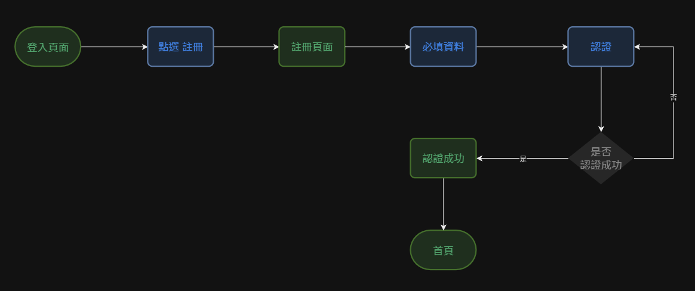
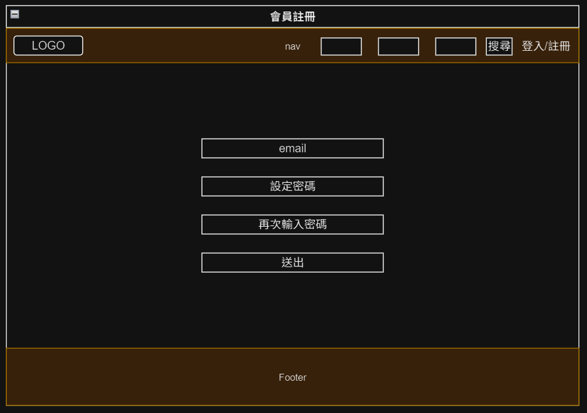

# 註冊會員

## 操作流程

## 頁面說明

|頁面元件|類別|操作|系統回應與詳細處理邏輯|
|---|---|---|---|
|Email|Input|Type|1.  必填  2. 必需符合email格式  3. Email為帳號，不可重複，因此需檢查電子郵件帳號是否已被使用|
|設定密碼| Input| Type| 1.  必填  2. 可輸入英文、數字與特殊符號 3. 最大可輸入長度為20|
|確定密碼| Input| Type| 1.  必填  2. 可輸入英文、數字與特殊符號 3. 最大可輸入長度為20|
|送出|Button|Submit|驗證 input 內資料是否相符: 1. 相符：提示會員註冊成功，請至所填寫的信箱收取認證信件，頁面導向至 [註冊成功](Pages/layout/account/signup-success.md)　 2. 不相符：送出失敗，停留此頁面顯示錯誤提示 |

