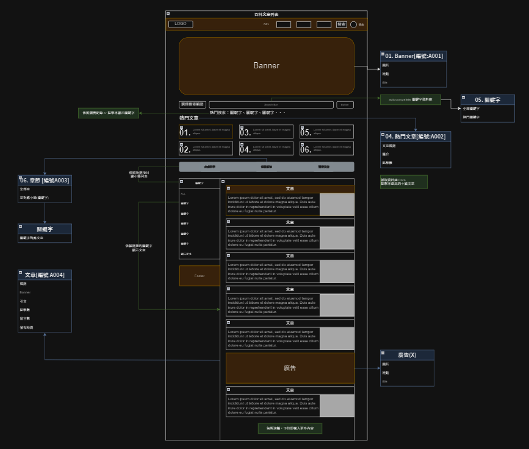
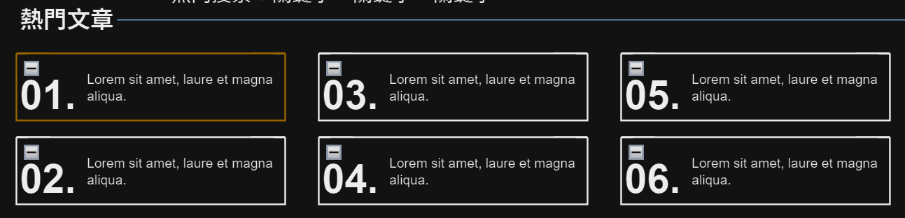
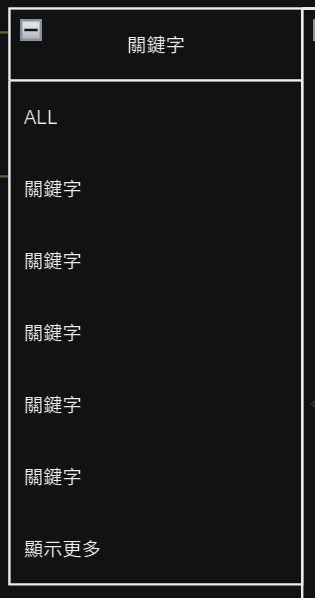
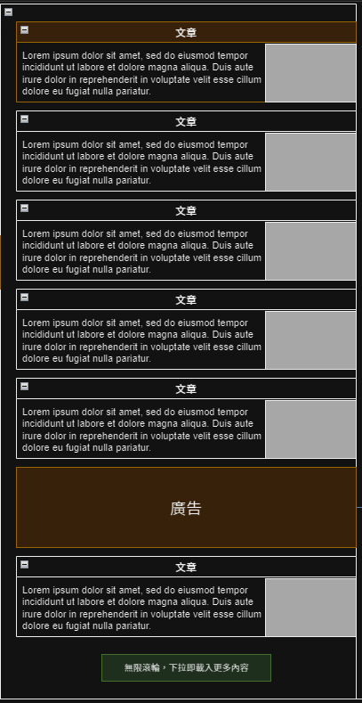

# 文章列表
> 顯示熱門文章、文章分類及所有文章，預設顯示第一個類別的文章列表，按照發布時間排序最新的在上。

## 頁面說明

### 熱門文章
顯示最高點閱率的文章（文章標題／簡介／點擊數）。

 

### 章節
- 顯示三個已分類好的章節，分別是：皮膚科學、保養新知、醫學美容。
- [章節API](https://beautyapp2.docs.apiary.io/#reference/0/a003-/get)

 

### 關鍵字
對應章節顯示章節設定的關鍵字，預設顯示第一個章節：皮膚科學。

|頁面元件|類別|操作|系統回應與詳細處理邏輯|
|---|---|---|---|
|全部文章|Link|Click|顯示章節內全部文章列表|
|關鍵字|Link|Click|依[章節API](https://beautyapp2.docs.apiary.io/#reference/0/a003-/get)顯示章節內所屬關鍵字  點擊後文章列表切換顯示該關鍵字的[關聯列表](Pages/layout/content/related-article.md)|

 

### 文章列表
對應關鍵字的選擇顯示文章列表，預設顯示 全部文章。

|頁面元件|類別|操作|系統回應與詳細處理邏輯|
|---|---|---|---|
|文章|Link|Click|點擊後導向至各 [文章](Pages/layout/content/article.md)|
|廣告(二階段)|img/Link|Click|點擊後開啟新頁面，網址由 API 資料獲取|
|載入更多文章|---|滾動觸發|當視窗畫面移動到視窗底部後，載入更多文章|

