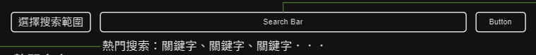

# 內文系統

## 頁面結構

### Banner
同通用元件：[Banner](Pages/components/banner.md)

### Search Bar

|頁面元件|類別|操作|系統回應與詳細處理邏輯|
|---|---|---|---|
|選擇搜索範圍|Select|Select|---|
|搜索框|Input|Type|輸入想搜尋的關鍵字，auto complete 選單顯示資料庫內關鍵字供使用者選擇|
|搜索按鈕|Button|Click| 觸發下方主要內容變化為 [關聯列表](Pages/layout/content/related-article.md) |
|熱門搜索關鍵字|Link|Click|依照瀏覽紀錄/點擊率顯示排名前5高的關鍵字，點擊後跳轉至該關鍵字的 [關聯列表](Pages/layout/content/related-article.md)|

---

### Main 主要內容
此範圍隨搜索功能是否有被觸發顯示[文章列表](Pages/layout/content/article-list.md)或者[關聯列表](Pages/layout/content/related-article.md)。

