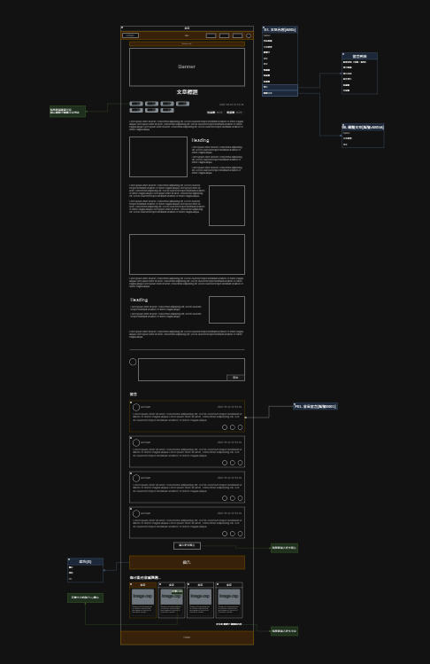
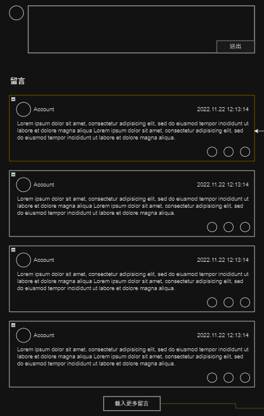
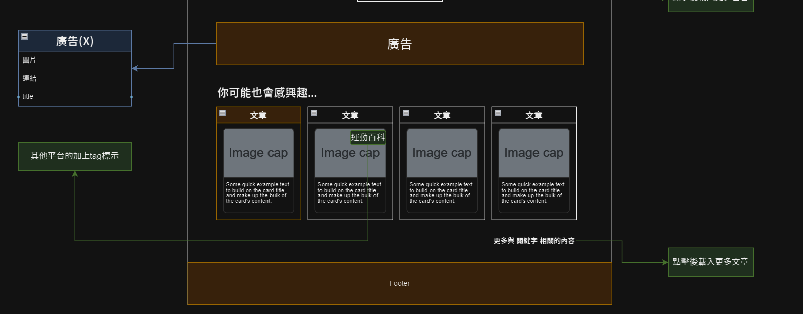

# 文章
> 點擊任何一篇文章後進入。

## 頁面說明

### Breadcrumb
顯示目前頁面資訊的層級關係。

|頁面元件|類別|操作|系統回應與詳細處理邏輯|
|---|---|---|---|
|首頁|Link|Click|跳轉至[首頁](Pages/layout/homepage/default.md)|
|文章列表|Link|Click|跳轉至[文章列表](Pages/layout/content/article-list.md)|
|文章名稱|Text|---|顯示本篇文章標題|

### Banner
同通用元件：[Banner](Pages/components/banner.md)

---

### 文章內文
> 放置文章內文，由 [文章內容API](https://beautyapp2.docs.apiary.io/#reference/0/a005-/get-{id}=id-l002) 獲取資料。

#### 基本資料

|頁面元件|類別|操作|系統回應與詳細處理邏輯|
|---|---|---|---|
|文章標題|Text|---|---|
|發布時間|Text|---|---|
|關鍵字|Link|---|跳轉[關聯列表](Pages/layout/content/related-article.md)|
|點閱數|Text|---|---|
|收藏數|Text|---|---|
|引文|Text|---|---|

#### 文章內文
放置文章內容圖文。

---

### 留言

|頁面元件|類別|操作|系統回應與詳細處理邏輯|
|---|---|---|---|
|發表留言|Textarea|Type|輸入留言內容|
|送出|Button|Submit|送出資料並重新獲取留言列表資料，[會員留言POST](https://beautyapp2.docs.apiary.io/#reference/0/b003-/post)送出|
|留言列表|Text & Button| ---|預設顯示最後發表的五篇，資料來源：[文章留言列表API](https://beautyapp2.docs.apiary.io/#reference/0/a005a-/get-{id}=id) 每個留言顯示資料包含：留言內容/留言會員/留言時間/點讚數/收藏留言數|
|載入更多留言|Button|Click|點擊後載入更多留言|

 

### 廣告 & 推薦文章

|頁面元件|類別|操作|系統回應與詳細處理邏輯|
|---|---|---|---|
|廣告 (二階段)|Img/Link|Click|點擊後開啟新頁面，網址由 API 資料獲取|
|推薦文章|Link|Click|依照文章關鍵字標記/會員檢測結果顯示關聯文章，按照點閱數顯示最高的五篇。|
|更多關聯內容|Button|Click|點擊後載入更多推薦文章，左右滑動切換|

