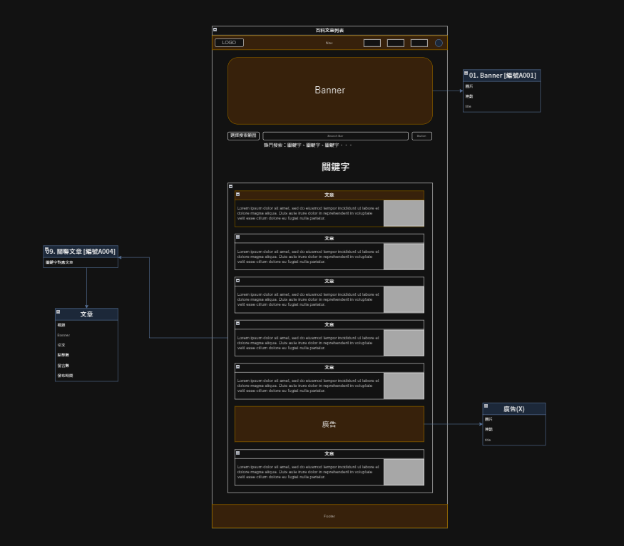

# 關聯列表
> 點選關鍵字後顯示所有被標記該關鍵字的文章。
- [關鍵字關聯API](https://beautyapp2.docs.apiary.io/#reference/0/a004-/get[-{id}=id)

## 頁面說明

|頁面元件|類別|操作|系統回應與詳細處理邏輯|
|---|---|---|---|
|搜索字詞|Text|---|標題顯示搜索的字詞或關鍵字|
|文章|Link|---|點擊後導向至該[文章](Pages/layout/content/article.md)|
|廣告 (二階段)|Link|Click|點擊後開啟新頁面，網址由 API 資料獲取|

