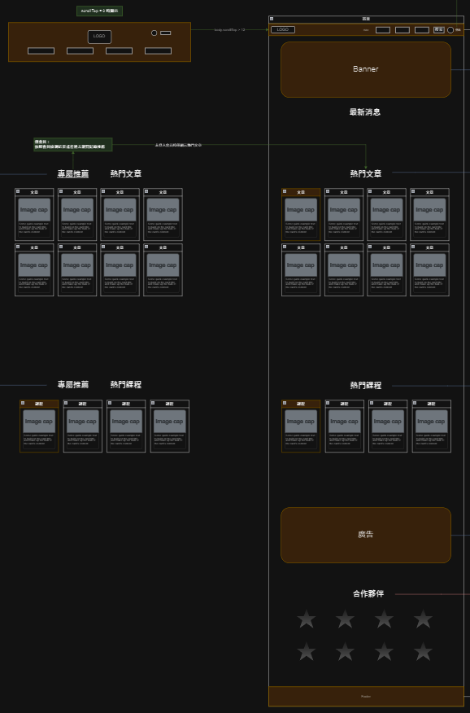

# 首頁
> 預設使用者進網站的入口頁面。

## 頁面結構

### Header
通用元件：[Header](Pages/components/header.md)

### Banner
通用元件：[Banner](Pages/components/banner.md)

---

### Main Content
> 此區塊內容隨操作變動。

|狀態|觸發條件|顯示內容|
|---|---|---|
|default| onload| 分為文章推薦區塊、課程專欄推薦區塊、廣告欄、合作夥伴|
|頁面資訊切換|Header觸發搜索後|顯示 [搜尋結果列表](Pages/layout/homepage/searchresult.md)|
|頁面資訊切換|Click 關於我們|跳轉至 [關於我們](Pages/layout/homepage/aboutus.md)|
|頁面資訊切換|Click 聯絡資訊|跳轉至 [聯絡資訊](Pages/layout/homepage/contactus.md)|
|頁面資訊切換|Click FAQ|跳轉至 [FAQ](Pages/layout/homepage/faq.md)|

 

#### 文章推薦區塊
- 分 專屬推薦  及 熱門文章  兩個 tab，未登入時僅顯示 熱門文章；登入時按照會員檢測結果或瀏覽紀錄顯示 專屬推薦。
- [熱門文章API](https://beautyapp2.docs.apiary.io/#reference/0/a002-/get-l002)

 

#### 課程專欄推薦區塊(二階段)
- 二階段進行
- 分 專屬推薦  及 熱門課程  兩個 tab，未登入時僅顯示 熱門課程；登入時按照會員檢測結果或瀏覽/購買紀錄顯示 專屬推薦。

 

#### 廣告欄(二階段)
- 二階段進行
- 輪播圖片，圖片資料由 API 獲取，包含 src, titel, alt, link 四個屬性
- 最大寬度限制 max-w-6xl

 

#### 合作夥伴
- 設置 constants 顯示公司名稱、logo、網站連結。

!> 可考慮是否使用 API fetch

---

### Footer
通用元件：[Footer](Pages/components/footer.md)
